Payday 2 Secret
---------------
Information for solving the secret in PD2.

[日本語](README_JA.md) | **English**

**SPOILERS AHEAD**


Requirements
------------
 * 4 players with Piano puzzle completed in safehouse, and 20 achievements unlocked

How To Solve
------------

### Obtain and Display required items in the Safehouse
Specific trophies need to be obtained and displayed to start the initial puzzle:

1. Bain's Guide

   `No Mercy - Normal`

1. The Elephant's Coffer

   `Breakin' Feds - Normal`

1. The Healer's Coffer

   `Golden Grin - Normal`
   `Henry's Rock - Normal`

1. The Medallion of Perseids

   `Brooklyn Bank - Overkill`

1. The Obsidian Plate

   `Shacklethrone Heist - Normal`

1. The Scribe's Coffer

   `Henry's Rock - Normal`

 * Once you have these, display them and enter the safehouse
 * Pickup the medallion and use it to open coffers

### Unlock list of "Obsidian" achievements in Safehouse
You need to unlock a list of achievements in safehouse to complete, dictated by
the Obsidian Tablet. Once all the required display items are done (above), goto
the piano in Scarface's office and hit the following keys in order.

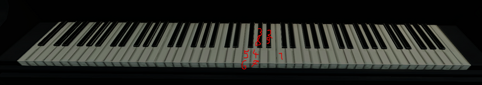

This will stop the device from rotating. Interacting with the device will reveal
ciphered riddles. These turn out to be required achievements to enable the
secret.  
**Note**: Every time you hit the piano keys, these required achievements list are re-rolled.

You can translate all **20** displayed for your account which appears to be
**individual** (meaning you have to translate), or be safe and just do all
**57** here.

These are listed here with translations:

1. Diamonds are Forever

   `When the four thieves stole precious rocks from the small store they left
    before the law could get to the scene.`

1. A Good Haul

   `In the house of capitalism the four thieves stole a large amount of
    valuables before making their escape.`

1. I Will Pass Through Walls

   `Under the cover of night and shadows the thieves stole many bags of
    valuables and not a single drop of blood was spilled.`

1. All Eggs in One Basket

   `The four thieves placed their loot in the street, then a large bird came and
    took it all in one single swoop.`

1. Hostage Situation

   `The four thieves guarded the innocent until they made their escape with the
    valuable bounty from the house of carbon.`

1. But Wait - There’s More

   `From a well guarded transport the Four Thieves found out about a secret
    shipment containing a valuable weapon.`

1. We’re Gonna Need a Bigger Boat

   `As The four thieves stole the valuable weapon they also took all the
    munitions they could find.`

1. Self Checkout

   `When the four thieves were asked to destroy a large store their actions were
    as fast as they were devastating`

1. Platinum Card (Or: “Yeah, He’s a Gold Digger”)

   `The four thieves strolled down the street cleaning out each stop they passed
    despite every effort the law couldn’t stop them.`

1. What’s in the Box?

   `Great value rained from the sky and the four thieves opened any packages in
    their quest for riches`

1. Let’s do th...

   `The four thieves stole a valuable head ornament so fast that no one had a
    chance to react.`

1. They Don't Pay Us Enough

   `The four thieves were asked to steal something very dangerous they took
    everything of value and left nothing behind.`

1. Bring It Back Safe

   `As the earth shook the four thieves stole ten boxes of great value.`

1. Let Them Boogie

   `As people were dancing to the music the four thieves crept through the
    shadows and stole what was locked away.`

1. The Grinch

   `As the snow fell, the fours thieves attacked a large store and took
    everything of value.`

1. Out of bounds

   `The four thieves were surrounded on the docks but they kept their enemies
    away from the loot until it was all sent away`

1. Lord of War

   `On the day that burned the four thieves absconded with all the elements of
    death.`

1. Full Measure

   `In an old abandoned house the four thieves made as much blue as they could
    with the resources available.`

1. Doctor Fantastic

   `The four thieves with all their wit could identify the mechanism they needed
    to steal with the greatest of ease.`

1. I Wasn't Even There!

   `Under the cover of darkness the four thieves quietly stole the valuable
    metal and replaced it with white dust.`

1. I'm A Swinger

   `The four thieves influenced the world around them and changed the course of
   society without anyone ever finding out.`

1. Don't bring the Heat

   `The four thieves robbed the largest bank ever built without alerting the
    law.`

1. Walk Faster

   `A house full thugs and low lifes could not stop the four thieves from
    reaching their target.`

1. Watch The Power Switch!

   `The four thieves held their ground as their friend worked and because of
    their efforts he was completely uninterrupted.`

1. Silent But Deadly

   `When the four thieves were betrayed their revenge was precise and quiet no
    one knew they had been there until it was too late.`

1. Cat Burglar

   `The four thieves stole a rare rock of great value and importance without
    anyone noticing that they were there.`

1. High Roller

   `The four thieves attacked the house of smiles and fortune they quickly
    opened the vault and found their goal.`

1. I've got the Power

   `By the docks the four thieves went about their business without
    interruptions.`

1. Pump It Up

   `In the forest four thieves kept the pipe from their river intact.`

1. Settling a Scar

   `The four thieves attacked the mansion with great speed and ferocity.`

1. Sound of Silence

   `As the party was in full swing the four thieves went about their business
    and none ever knew they were there.`

1. Dr. Evil

   `The four thieves once created for themselves a large fortune.`

1. OVERDRILL

   `The hidden vault was hard to find and difficult to open but the four thieves
    worked together and claimed the legendary treasure.`

1. Remember, No Russian

   `As the liquid turned to vapor the four thieves watched over the dead never
    letting their power by taken away thereby staving off the darkness.`

1. Hazzard County

   `The four thieves stole goats and hidden treasures once the deed was done
    they quickly made their escape together.`

1. Santa Slays Slackers

   `The four thieves guarded the packer as they prepared the next shipment even
    as the law came charging in.`

1. Gone in 240 seconds

   `When stealing from the saddlers workshop the four thieves did so in a great
    hurry.`

1. Full Throttle

   `The four thieves attacked a train in motion they quickly made it to the last
    cars to see what they were after and made it back to their escape.`

1. Quick Draw

   `A room full of riches, a house full of thugs. The four thieves were quick
    and deadly and before anyone knew it all the thugs were dead.`

1. A Rendezvous With Destiny

   `The four thieves made their way through the abandoned building and quickly
    found their charge.`

1. Pacifish

   `The four thieves did not spill blood while on the boat.`

1. Not Even Once

   `The four thieves interrupted a deal of great value but even though they were
    surrounded and cornered no one fell in the onslaught that followed.`

1. Making a Statement

   `Surrounded, the four thieves overcame grave danger and escaped the house of
    massacre.`

1. Clean House

   `The four thieves snuck into the mountain keep and they stole everything of
    value kept there.`

1. 1...2...3... JUMP!

   `On the day they came in to the word flying through the heavens the four
    thieves all fell together.`

1. It's Nice To Be Nice

   `The four thieves were surrounded in the street but they fought their way
    through the onslaught of enemies and not a single innocent was harmed.`

1. Attacked Helicopter

   `As the four thieves rescued the incarcerated man. They shot the large bird
    that tried to stop them from sending them into safety.`

1. The Fuel Must Flow

   `In a place of ice and snow, the four thieves made their vessel seaworthy
    without the guards being able to stop them.`

1. Blood Diamond

   `The four thieves overcame incredible difficulties in obtaining the blood
    stained jewel.`

1. Waste Not, Want Not

   `In the famous store for rings and rare stones the four thieves took
    everything of value despite the best efforts of the law.`

1. All the Gold in Brooklyn

   `For every month in the year four thieves would take tribute from the
    institution.`

1. Stalker

   `The four thieves understood the importance of never letting the quarry out
    of your sight until the task of destroying your nemesis complete.`

1. Hack This!

   `As the four thieves emerged from the mountain they were met by a hail of
    bullets but they easily out matched their foes.`

1. Press [F] to pay Respects

   `The four thieves found someone who deserved their respect.`

1. Beacon of... nope

   `When the four thieves came to the aid of their long lost friend they knew
    darkness was their ally.`

1. Keeping the Cool

   `In a place of healing the four thieves stole a vial of vile blood with speed
    and threats they keep all the people under control.`

1. The Pacifist

   `While Stealing A bomb from a train the four thieves did not spill a single
    drop of blood`

Complete **whitehouse** on **overkill or higher** mission as normal. Once in the
bunker, cut left and see painting. If requirements are met it will glow gold.
Remove the painting. Host will then recieve C4; enter room and go down elevator.

You will see room with 4 levers and a wheel. The outer wheel is a riddle, and
the inner wheels provide a way to answer.
 * Language is RIGHT to LEFT, answers should be put in from RIGHT to LEFT, on
   the outer most ring inwards.

Codewheels
----------
Translate characters using this table:
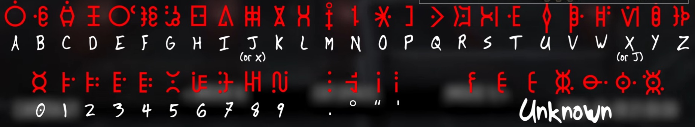

The translation on the rings for the answer are as follows

```text
Outer:  DAGILASWALCHXEAPSHCUZUSUGU
Middle: IGLSMCAWNVKFXOUBJHTQZREYDP
Inner:  DEELRURDTECEUTIDUNNTSSEROL
```
 * X/J are interchangeable
 * All wheels wrap around
 * If you mess up an answer, you will be reset to the first riddle
 * There are 4 riddles to answer

Riddles
-------
Known riddles with answers are here. The first image is the wheel match. The
second image is the symbol combination in the center.

```
The legacy of Alessandro Cagliostro calls to the eastern STAR
```
 * GUIDE


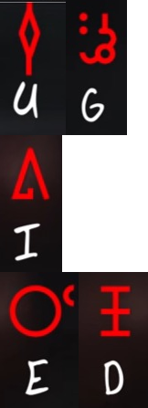

```
In the sand-covered lands of the pharaohs, I am followed by the missing LIGHT
```
 * SHEUT

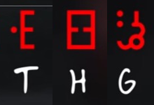
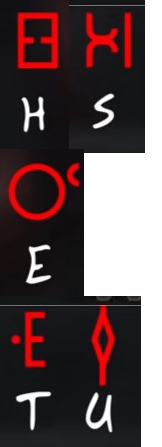

```
Twins exchange a breath, the third sibling is banished until it RETURNS
```
 * ALGOL

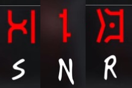
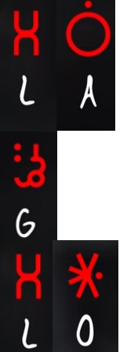

```
Upon the terrace of riches and wealth, I hold what all who behold me DESIRE
```
 * JEWEL

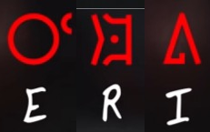
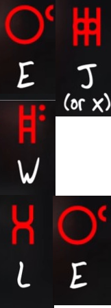

```
Among old recovered things, four couples are eternally locked in their LOVE
```
 * DANCE

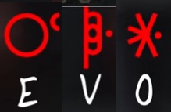
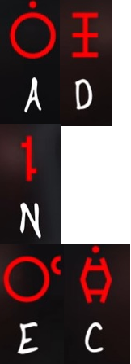

```
I must face two to ascend, lest I meet my final journey in this CHALLENGE
```
 * CHESS

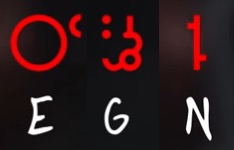
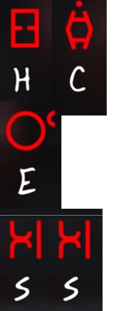

```
With my companions wisdom and ferocity that which i fly over that is my LAND
```
 * SUMER

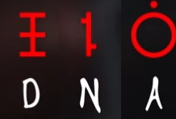
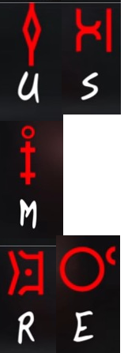

```
That of the watcher which will be consumed in the voice of SUMER
```
 * ZUMRU

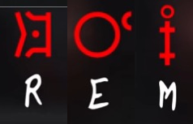
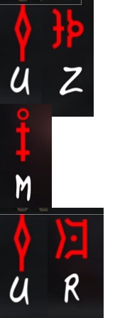

```
I can be trusted to guard the great wealth of the land but do not trust my WORDS
```
 * APATE

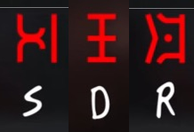
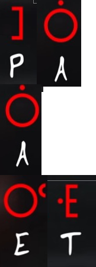

```
At the gates of silent memory, the lizard god speaks thy NUMBER
```
 * LAHUN

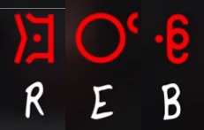
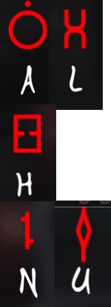

```
In the temple of gold and white, I bind myself to my psyche FOREVER
```
 * CUPID

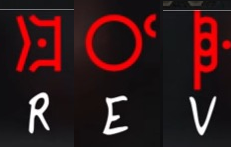
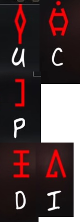

```
I am the bearer of the greatest gifts, I give what you seek THE MOST
```
 * GIANT


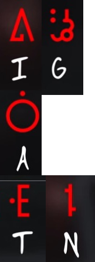

```
I stand in front of the humble man on the wicked path as a COMPANION
```
 * SWORD

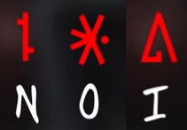
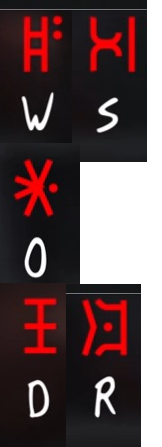
